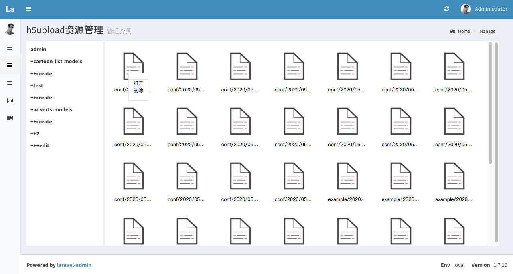

# H5直传阿里云oss扩展

### 更新扩展的话请把public/vendor/laravel-admin-ext/h5upload里面的h5upload和config/h5upload.php文件删除,在重新发布文件,后续会解决这个问题

### 1.使用composer安装monsteryuan/h5upload扩展

````
composer require monsteryuan/h5upload 1.0.7.x-dev -vvvv
````

### 2.迁移数据库文件

````
使用命令行php artisan admin:install 迁移数据库文件
````

### 3.导出资源文件

`windows`:`php artisan vendor:publish --provider=Encore\h5upload\h5uploadServiceProvider`

`mac|linux`:`php artisan vendor:publish --provider=Encore\\h5upload\\h5uploadServiceProvider`

### 4.在`app/Admin/bootstrap.php`添加代码

```
Encore\Admin\Form::extend('h5upload', \Encore\h5upload\h5uploadFiled::class);
```

### 5.在form方法里面使用

``
$form->h5upload('url','视频');
``

### 设置允许上传扩展的文件

```
可选扩展:video视频类型文件 file所有类型的文件 mp3音频文件 image图片文件
$form->h5upload('url','视频')->setExpansion('video');
```

### 设置多文件上传
```
$form->h5upload('url','h5upload')->setMultiple();
```

### 关于.env配置文件
```
请打开网站https://help.aliyun.com/document_detail/100624.html?spm=a2c4g.11186623.2.10.316879b0jDJxFq#concept-xzh-nzk-2gb根据提升一步一步添加配置
```

```
.env 配置文件模板

H5UPLOAD_TYPE_DEV 使用的驱动,默认本地

# 阿里云配置
ALIYUN_OSS_PUBLIC_DOMAIN=bucket里面的链接
ALIYUN_OSS_PRIVATE_DOMAIN=bucket里面的链接
ALIYUN_OSS_ACCESS_KEY=
ALIYUN_OSS_ACCESS_SECRET=
ALIYUN_OSS_ENDPOINT=oss节点
ALIYUN_OSS_BUCKET=bucket名称
ALIYUN_OSS_BUCKET_PRIVATE=dev-future-private
ALIYUN_OSS_DOMAIN=bucket域名
ALIYUN_STS_RAM=上面设置的ram账户
ALIYUN_STS_ENDPOINT=sts节点
ALIYUN_STS_REGION_ID=区域

# 模板
ALIYUN_OSS_PUBLIC_DOMAIN=https://dev-future-public.oss-cn-qingdao.aliyuncs.com
ALIYUN_OSS_PRIVATE_DOMAIN=https://dev-future-private.oss-cn-qingdao.aliyuncs.com
ALIYUN_OSS_ACCESS_KEY=
ALIYUN_OSS_ACCESS_SECRET=
ALIYUN_OSS_ENDPOINT=oss-cn-beijing.aliyuncs.com
ALIYUN_OSS_BUCKET=
ALIYUN_OSS_BUCKET_PRIVATE=dev-future-private
ALIYUN_OSS_DOMAIN=http://image.dev.zgwjzg.com
ALIYUN_STS_RAM=acs:ram::***:role/jack
ALIYUN_STS_ENDPOINT=sts.cn-qingdao.aliyuncs.com
ALIYUN_STS_REGION_ID=cn-beijing

# 如果不想使用env来配置,可以直接修改config/h5upload.php来配置

# 阿里云
'endpoint' => '节点',
'bucket' => 'bucket名称',
'access_key' => '阿里云的oss的key,这个应该好找',
'access_secret' =>'对应上面的密匙',
'sts_ram' => 'sts的ram账户',
'sts_endpoint' => 'sts的节点',
'sts_region_id' => '地域id',
'public_domain' => 'oss公开的域名',
'domain' => '这个还是填一下,填为上面的public_domain',

```

### 设置阿里云oss的跨域


### 文件管理页面
```
访问页面 admin/manage 查看已经上传的文件
```

### 需要在其他地方获取详细的资源链接
```
从容器获得后使用
app(ThirdPartyUpload::class)->getResourceUri([1,2,3]);
使用助手函数使用,助手函数有提示
h5upload()->getResourceUri([1,2,3]); or getResourceByIds([1,2,3]);
```

### tips
```
如果有什么问题可以联系email:643145444@qq.com,作者会在时间充足的情况下更新扩展
```

### 资源管理页面




#有更好的点子
### 1.复制文件
``
app/Admin/Extensions/laravel-admin-ext/h5upload
``

### 2.修改项目composer.json文件的repositories 加入

````
 "monsteryuan/h5upload": {
   "type": "path",
   "url": "app/Admin/Extensions/laravel-admin-ext/h5upload"
 }
````

### 3.安装本地

```
composer require monsteryuan/h5upload -vvvv
```

### tips 

```
isset 已有一些朋友发现的问题,并有些得到了解决.有什么问题请先查看isset
```
